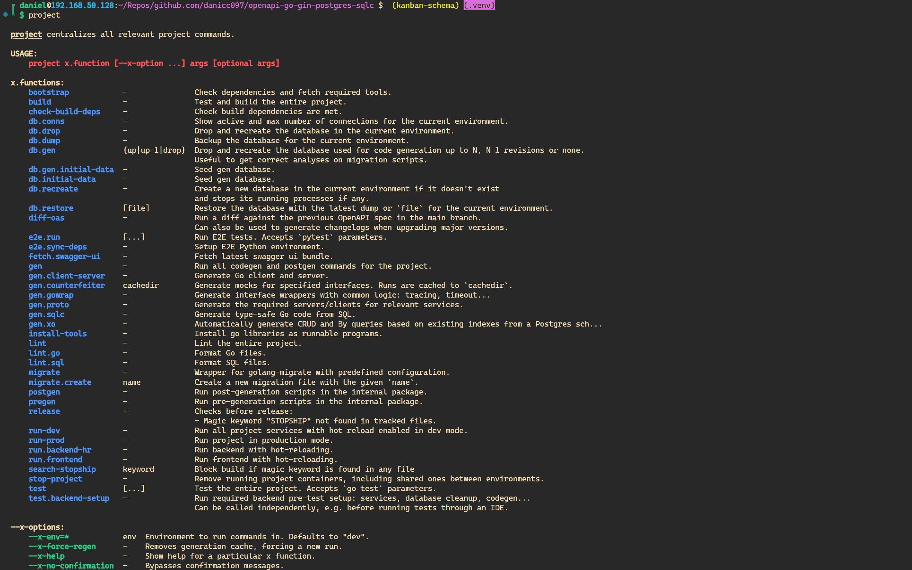

# openapi-go-gin-postgres-sqlc

[](https://goreportcard.com/report/github.com/danicc097/openapi-go-gin-postgres-sqlc)
[](https://pkg.go.dev/github.com/danicc097/openapi-go-gin-postgres-sqlc)

API-first and Database-first approach with OpenAPI v3, sqlc codegen and an
unimaginative title.
Featuring an overhaul of the [Go Gin
server](https://github.com/OpenAPITools/openapi-generator/blob/master/docs/generators/go-gin-server.md)
generator templates and a sensible post-generation tool that allows you to use cleanly
structured, easily extendable code by smartly merging nodes
from your modified and generated files' abstract syntax trees.

You also get dynamic ``x`` function and ``x`` flags and arguments documentation for
free from your own source and comments
so they're always up to date without any repetitive work: add/remove functions
and flags at will.




## OpenAPI schema magic fields

- **Struct tags** with `x-go-custom-tag` in schema fields get appended as is. Example (gin-specific):
```YAML
x-go-custom-tag: binding:"required[,customValidator]" [key:val ]
# Special case for ``format: date-time`` fields
# form data only:
x-go-custom-tag: time_format:"2006-01-02"
# the rest require custom unmarshalling if time is not RFC3339:
# see https://github.com/gin-gonic/gin/issues/1193
# there are some quirks to take into account as well:
# see https://segmentfault.com/a/1190000022264001
x-go-custom-tag: binding:"required"
```

Any custom field with an `x-*` name pattern in the OpenAPI spec will be available in
`vendorExtensions` in openapi-generator's mustache templates.

## TODOs

  - [Oauth2 as openapi
    spec](https://github.com/ybelenko/oauth2_as_oas3_components/tree/master/dist/components)
    with endpoints clearly documented based on RFCs
    Can generate a mock with e.g.
    [openapi-mock](https://github.com/muonsoft/openapi-mock).

  - equivalent of Python exception handler context manager but with global
  middleware on the api version route group:
      https://stackoverflow.com/questions/69948784/how-to-handle-errors-in-gin-middleware
      in combination with internal/rest/rest.go renderErrorResponse
    For parsing kinopenapi validation errors to our own more user
    friendly ValidationError check out
    https://github.com/getkin/kin-openapi/pull/197
    until data validation is updated: https://github.com/getkin/kin-openapi/pull/412

  - frontend miscellanea:
    1. codegen from oas:
      - ts client (openapitools)
      - react-query components (fabien0102/openapi-codegen)
      - React Query hooks, Axios requests and Typescript types (rametta/rapini)
      - Redux toolkit has its [own
        generator](https://github.com/reduxjs/redux-toolkit/tree/master/packages/rtk-query-codegen-openapi)
        and can generate hooks. Uses rtk-query.

