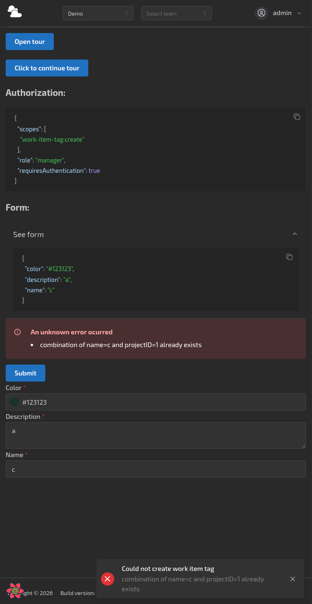
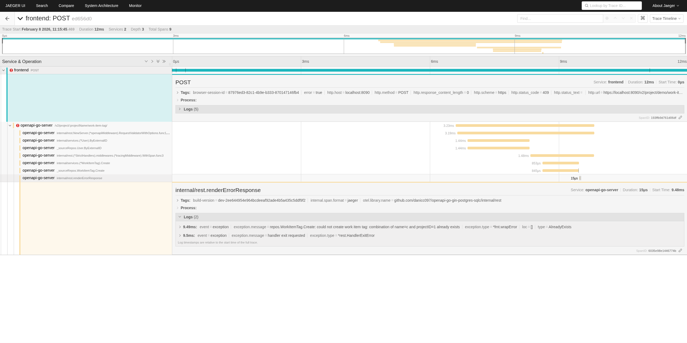

# openapi-go-gin-postgres-sqlc

[](https://goreportcard.com/report/github.com/danicc097/openapi-go-gin-postgres-sqlc)
[](https://pkg.go.dev/github.com/danicc097/openapi-go-gin-postgres-sqlc)
[](https://github.com/danicc097/openapi-go-gin-postgres-sqlc/actions/workflows/tests.yaml)

Example full stack app with an API-first and Database-first approach with OpenAPI v3, sqlc+xo codegen,
generated backend, frontend client and validators and an unimaginative title.

> NOTE: _This is a fever dream, though some features may inspire you regardless._

## What's this for?

An example fully featured app to showcase how an OpenAPI v3 spec and database
schema become a real single source of truth at once. Any
change to it is validated and cascades down to:

- **frontend**: autogenerated complex, customizable and fully type-safe UI forms
  based on the OpenAPI spec converted to JSON
  schema. Generated API queries (`orval`). User-friendly generated client-side
  validation
  (via `react-hook-form` and `ajv` plus customized `kin-openapi` error
  messages for backend errors). Check out the frontend home page for available links.
- **backend**: generated Gin server (custom `oapi-codegen` and post-generation).
  Request and response validation (`kin-openapi`). Generated CRUD and index queries via `xo`
  and custom queries via `sqlc` by leveraging custom `xo` template generation
  that ensures compatibility. Integrated OpenID Connect client via
  `zitadel/oidc` (and dockerized authorization server for development in
  `cmd/oidc-server` based on reusable mock server with generics in
  [oidc-server](https://github.com/danicc097/oidc-server)). App events processing
  via Server Sent Events.

  Queries generated by `xo` use `pgx` exclusively and includes
  pagination, indexes, soft delete handling, extensible queries (parameterized `where`, `having` clauses), joins and
  much more (see [xo integration
  tests](./internal/repos/postgresql/xo-templates/tests/)) that will get you
  **95%** there without resorting to ad-hoc queries. Found an edge case or want additional functionality just for
  your DB needs? Just edit `xo-templates/`, since codegen is interpreted by
  `yaegi`. Additionally, by
  using `pgx`, models can be easily re-exported as usable OpenAPI schemas via
  `openapi-go` and some magic Bash and Go utility programs that keep generated
  code in order.

  Since using DB models in all backend layers is considered an anti-pattern at
  some level of model complexity, you're not tied to generated schemas from DB
  models.
  Any struct can become a spec schema via `openapi-go` struct tags and some
  simple bash code behind to grab them, with minimal caveats. See `rest`
  package. It is even possible to reference openapi spec models in your `xo`
  generated models, as long as they don't create any circular dependencies.
  Since at the last generation step we generate all spec schemas back to Go models with `oapi-codegen` to
  a shared `models` package, this is not an issue (although you'd have to
  choose what models to use, since there'll duplication for the models
  that were already generated by `openapi-go` in the first place - ideally, use the
  originals).

Additionally, it features OpenTelemetry in both browser (automatic and
manual instrumentation) and backend services (manual instrumentation) via
Jaeger, TimescaleDB and ~~Promscale~~ (discontinued, should look at options like
`mimir`).

Example generated form with tracing:

<details>


</details>

## Makefile alternative

You get dynamic `x` function and `x` options parameters documentation _and_
autocompletion (`complete -C project project`) for
free (from your own source itself and comments)
so they're always up to date without any repetitive work: add/remove functions
and flags at will.
Custom internal autocompletion functions for each `x` function or `x` option can be
easily setup.


All calls to `x` functions are logged (distinguishing stdout and stderr) for easier parallel execution and nested
calls tracking:


And help for any `x` function is easily searchable when the app inevitably grows
with `--x-help`:


## Setup

### Configuration and local development

Fill in `.env.template`'s:

```bash
find . -name ".env*.template"
```

For `dev` environment, you may use `env.ci` as a starting point,
replacing `ci` with `dev` and using `REVERSE_PROXY_API_PREFIX=""` since it will run
the backend without docker containers.

Assuming a recent Ubuntu release:

```bash

sudo apt install direnv -y
direnv allow # you can also customize direnv with .envrc.local as you would a regular .envrc, see example

cp openapi-go.code-workspace.example openapi-go.code-workspace # edit as desired

project bootstrap # dependency and tools interactive installation
project recreate-shared-services
project gen
project db.initial-data
project run.all
```

For first test run:

```bash
project test.backend.setup
project test.backend
project test.frontend
```

### Tracing, monitoring...

```bash
bin/deploy-instrumentation
```

## Notes on code generation

### `xo`

Db struct mappings can be extended with SQL column comments, joined with `&&`:

- `properties`:`<p1>,<p2>,...`
  - `private`: exclude a field from JSON.
  - `not-required`: make a schema field not required.
  - `hidden`: exclude field from OpenAPI generation.
  - `refs-ignore`: generate a field whose constraints are ignored by the referenced table,
    i.e. no joins will be generated.
  - `share-ref-constraints`: for a FK column, it will generate the same M2O and M2M join fields the ref column has.
- `type`: override the type annotation with an existing spec schema. Also allows
  complex JSON columns to be encoded and decoded thanks to `pgx`.
- `cardinality`:`<O2O|M2O|M2M>` to generate/override joins explicitly. Only O2O is inferred.
- `tags`: append literal struct tag strings.

### `rest` package

Structs in `models.spec.go` will be generated via `openapi-go` and replaced in
the spec. Make sure they don't clash with existing `models` names or db tables.

### `models` package

Combines db codegen via a custom `xo` alongside spec schemas codegen for ease of use.

### CRUD + tests generation

See `project test.create-crud-gen`'s implementation for an example workflow to create a
variety of implemented CRUD endpoints and relevant tests for a given database
table.
This is a one-off script per table.

### OpenAPI spec

#### Paths

Endpoints are exclusively managed through the spec and created/kept up to date
in their respective files aggregated by `tags` (limited to one)
via codegen and AST modifications. This ensures the server always implements the
spec.

For endpoint implementation, only method bodies are to be modified.

#### Vendor extensions

Component schemas:

- `x-gen-struct` generates a schema from a struct and keeps it up to date,
  which can be tagged with OpenAPI fields (via openapi-go).
  Possible structs to generate from are listed in `internal/codegen/structs.gen.go`
  indexed by `x-gen-struct`.
  Packages to generate structs from are added adhoc (currently rest and models packages only)
  Note that rest package structs are generated without prefix since they
  are the base of the spec - else prefix is the pascal cased package name.
  The value of `x-gen-struct` must match the schema name, to prevent duplicates and
  confusing definitions.
  To use a yet to be generated `rest` package struct in spec `paths`, simply use the `$ref`
  without creating any schema and it will be autogenerated later if it doesn't exist
  (only for `rest` package structs, since any other should not be used as request/response in the
  first place).
- `x-spec-rest-type`: set to true to mark rest types (i.e. request, responses, query params...) that are manually defined in the spec instead of structs in `models.spec.go`.
  Path operations:
- `x-required-scopes` defines required scopes for a request.
- `x-required-role` defines the minimum required role for a request.

<!-- xo custom templates with cardinality, property comments for join and public model generation for embedding, schema from structs, spec sync -->

## Architecture

Simplified:


## Known issues

- Nested functions in `project`'s `x` functions will break automatic
  documentation for that particular function due to a bug in `declare` where the last nested function line
  number is returned instead of the parent.

## TODOs

- Meaningful project name.

- System design docs/diagrams.
