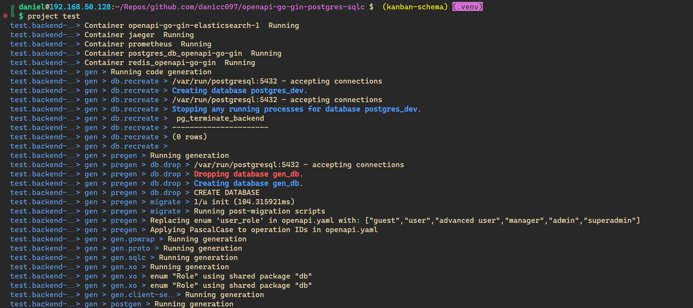
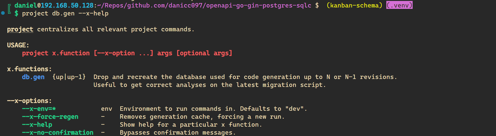
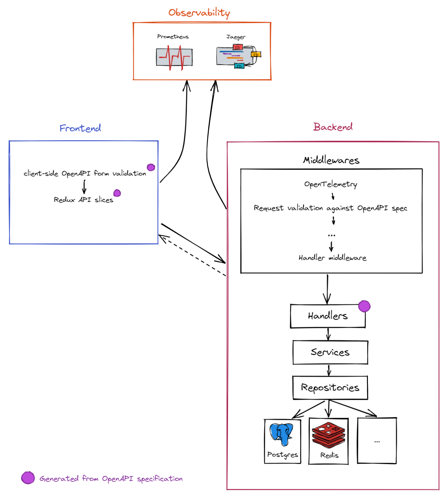

# openapi-go-gin-postgres-sqlc

[](https://goreportcard.com/report/github.com/danicc097/openapi-go-gin-postgres-sqlc)
[](https://pkg.go.dev/github.com/danicc097/openapi-go-gin-postgres-sqlc)
[](https://github.com/danicc097/openapi-go-gin-postgres-sqlc/actions/workflows/tests.yaml)

Example full stack app with an API-first and Database-first approach with OpenAPI v3, sqlc+xo codegen,
generated backend, frontend client and validators and an unimaginative title.

## What's this for?

Your OpenAPI v3 spec and database schema become a real single source of truth. Any
change to it is validated and cascades down to:

- **frontend**: generated API queries (`orval`). User-friendly generated client-side validation
  (via `openapi-typescript-validator` and customized `kin-openapi` error messages).
- **backend**: generated Gin server (custom `oapi-codegen` and post-generation).
  Request and response validation (`kin-openapi`). Generated CRUD and index queries via `xo`
  and custom queries via `sqlc` by leveraging custom `xo` template generation
  that ensures compatibility. Integrated OpenID Connect client via
  `zitadel/oidc` (and dockerized authorization server for development in `external/oidc-server`).

  Queries generated by `xo` use `pgx` exclusively and includes
  pagination, indexes, soft delete handling, extensible queries and joins via options, and
  much more (see [xo integration
  tests](./internal/repos/postgresql/xo-templates/tests/)) that will get you
  **95%** there without resorting to ad-hoc query. Found an edge case or want additional functionality just for
  your DB needs? Just edit `xo-templates/`, since codegen is interpreted by
  `yaegi`. Additionally, by
  using `pgx`, models can be easily re-exported as usable OpenAPI schemas via
  `openapi-go` and some magic Bash and Go utility programs that keeps generated
  code in order.

  Since using DB models in all backend layers is considered an anti-pattern at
  some level of model complexity, you're not tied to generated schemas from DB
  models.
  Any struct can become a spec schema via `openapi-go` struct tags and some
  simple bash code behind to grab them, with minimal caveats. See `rest`
  package. It is even possible to reference openapi spec models in your `xo`
  generated models, as long as they don't create any circular dependencies.
  Since at the last generation step we generate all spec schemas back to Go models with `oapi-codegen` to
  a shared `models` package, this is not an issue (although you'd have to
  choose what models to use, since there'll duplication for the models
  that were already generated by `openapi-go` in the first place - ideally, use the
  originals).

Additionally, it features OpenTelemetry in both browser (automatic and
manual instrumentation) and backend services (manual instrumentation) via
Jaeger, TimescaleDB and Promscale (certified storage backend).

## Makefile alternative

You get dynamic `x` function and `x` options parameters documentation _and_
autocompletion (`complete -C project project`) for
free (from your own source itself and comments)
so they're always up to date without any repetitive work: add/remove functions
and flags at will.


All calls to `x` functions are logged (distinguishing stdout and stderr) for easier parallel execution and nested
calls tracking:



And help for any `x` function is easily searchable when the app inevitably grows
with `--x-help`:



## Setup

Assuming a recent Ubuntu release:

```bash

sudo apt install direnv
direnv allow # you can also customize direnv with .envrc.local as you would a regular .envrc, see example

cp openapi-go.code-workspace.example openapi-go.code-workspace # edit as desired

project bootstrap # dependency and tools interactive installation

```

### Configuration

- Fill in `.env.templates`:

  ```bash
  find . -name ".env*.template"
  ```

- Fill in `frontend/config.template.json`.


### Code generation

```
project gen
```


### Tracing, monitoring...

```bash
bin/deploy-instrumentation
```

## Code generation

Docs WIP:

- Backend generation pipeline
- Frontend generation pipeline
- External tooling summary and upgrades

<!-- xo custom templates with cardinality, property comments for join and public model generation for embedding, schema from structs, spec sync -->

## Architecture

Simplified:



## Changelog

- `v0.2`: discard `OpenAPITools/openapi-generator` with custom postgeneration for `deepmap/oapi-codegen`. Any
  change to fix broken generator functionality requires opening a PR or a disturbing
  amount of postgeneration code. Templates getting out of hand and also require
  a PR for custom functions. `oapi-codegen` much more extensible and idiomatic
  being already Go and properly maintained.

## Known issues

- Nested functions in `project`'s `x` functions will break automatic
  documentation for that particular function due to a bug in `declare` where the last nested function line
  number is returned instead of the parent.

## TODOs

- Meaningful project name.

- System design docs/diagrams.

- [Oauth2 as openapi
  spec](https://github.com/ybelenko/oauth2_as_oas3_components/tree/master/dist/components)
  with endpoints clearly documented based on RFCs
  Can generate a mock with e.g.
  [openapi-mock](https://github.com/muonsoft/openapi-mock).

